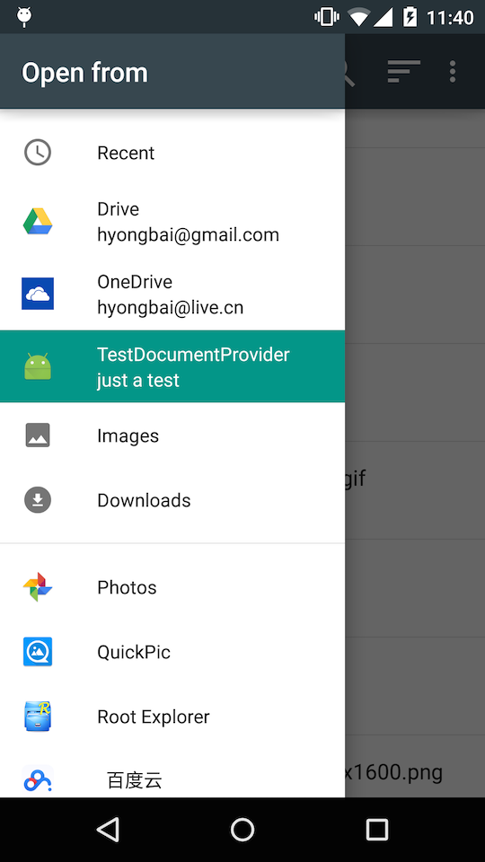
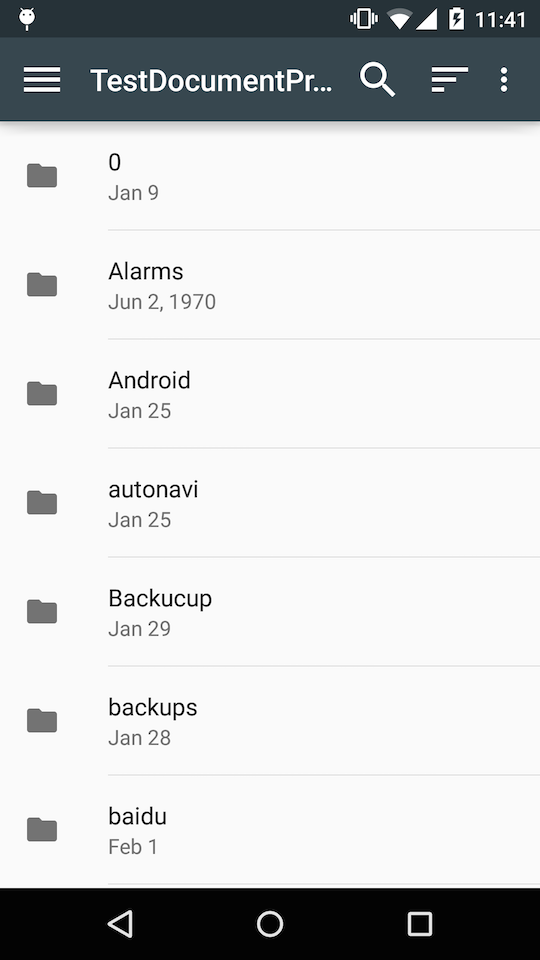
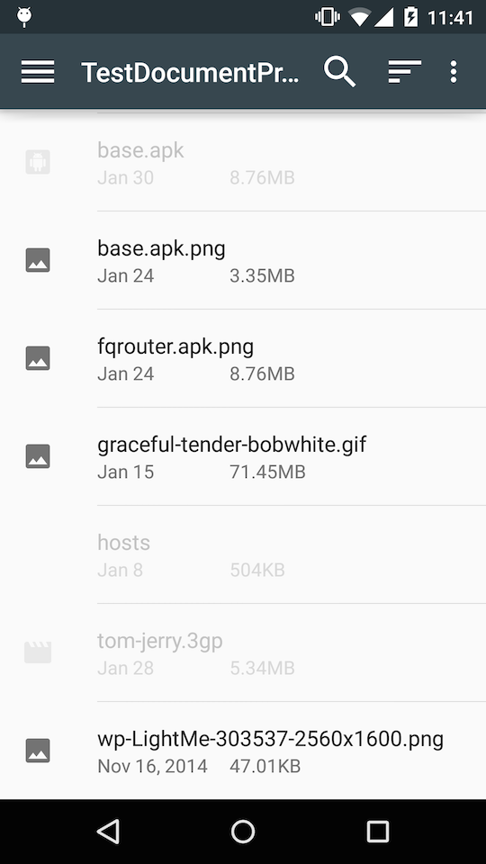

#DocProvider

This is an sample project to show how to write a client app using DocumentProvider.

For more information, visit [Storage Access Framework](https://developer.android.com/intl/zh-cn/guide/topics/providers/document-provider.html) for an official reference.

#Dependency

> Android-19+

#Screenshots

> - 
> - 
> - 

# Me

> - WEIBO: [@hyongbai](http://weibo/hyongbai)
> - TWEET: [@hyongbai](http://twitter.com/hyongbai)
> - GMAIL: [hyongbai@gmail.com](mailto://hyongbai@gmail.com)